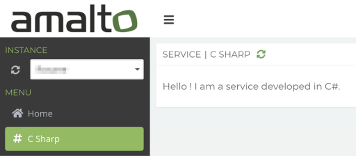

# Platform 6 C# Service Demo

> A demo service to show how to develop a __Platform 6__ service with [C#](https://docs.microsoft.com/en-us/dotnet/csharp/) using [Platform 6 C# connector][platform6-connector-csharp].

## Prerequisite

- Launch a local instance of [Platform 6](https://documentation.amalto.com/platform6/master/).
- Read and fulfill the requirements of [Platform 6 C# connector][platform6-connector-csharp].

## What is this demo about?

This project shows how to:

- create a simple Nancy application server,
- initialize a custom service on Platform 6,
- implement the endpoint that displays the service's user interface

## General notes about the user interface of the service

### The configuration interface

Every service should have a configuration interface.
It is the main screen displayed when a user clicks on the associated entry menu in the [Platform 6 Portal].
Here's the configuration interface of our demo service:



This interface is defined in the file [`ServiceConfiguration.tsx`](Platform6/Client/Sources/ServiceConfiguration.tsx) which has been developed using the framework [React](https://reactjs.org/).

> For now React is the only supported library on Platform 6.

The user interface must export a single main React component through a bundled JavaScript file (see [Webpack](https://webpack.js.org/) for bundling and [Babel](https://babeljs.io/) for transpiling).
This script will be injected and displayed on the _Portal_.

### Platform 6 UI components

To help you build the user interface of your custom service, a set of components is ready for use on Platform 6.
They can be included as a JavaScript dependency from the library [`platform6-ui-components`](https://github.com/amalto/platform6-ui-components).

The documentation of these components is available [online](https://documentation.amalto.com/platform6/master/develop-app/custom-service/platform6-ui-components/docs/).

## How to run the demo?

### Build the user interface

Go in the [client's directory](./Platform6/Client) and install its dependencies:

```console
$ cd Platform6/Client
$ npm install
```

Compile the TypeScript source files to generate the compiled bundle file `Platform6/Client/build/ServiceConfiguration.bundle.js`:

```console
$ npm run build
```

> You can also use the watch mode to generate a new bundle file after every change made to the source files. The command is then: `npm run build:watch`.

### Run the server of the service

The server in the demo is built using the framework [Nancy](http://nancyfx.org/).
To launch it, from the root directory:

Install the dependencies:

```console
$ cd Platform6
$ mkdir packages && cd packages
$ nuget install ../packages.config
```

Build the server:

Compile the C# classes to create the `.exe` in the folder `bin/Debug/`.

```console
$ msbuild Platform6/Service.csproj 
```

Run the server:

From the directory `bin/Debug/`, export some environment variables:

```console
$ export B2BOX_HOST=localhost && export EXTERNAL_URL=http://localhost:8888
```

Use [Mono](//www.mono-project.com/) to run the project:

```console
$ mono ./Service.exe
```

It should launch a server on the port `8888` then deploy the service __demo.csharp__ on Platform 6.

An entry menu _Csharp_ should appear in the menu of the _Portal_.

When you click on it, it should make a request to the endpoint `GET /api/${VERSION}/demo.csharp/portal`.
This endpoint returns the client's bundled JavaScript file `ServiceConfiguration.bundle.js` that you built [at the previous step](#build-the-user-interface).

Here is an example of the output:

```
/******/ (function(modules) { // webpackBootstrap↵/******/     // The module cache↵/******/     var installedModules = {};↵/******/↵/******/     // The require function↵/******/     function __webpack_require__(moduleId) [...]
```

The _Portal_ will use this response to display the user interface of the service.

[platform6-connector-csharp]: https://github.com/amalto/platform6-connector-csharp
[Platform 6 Portal]: http://localhost:8480/

## License

MIT © [Platform 6](https://www.platform6.io)